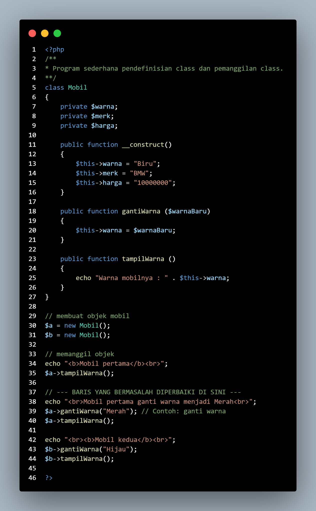
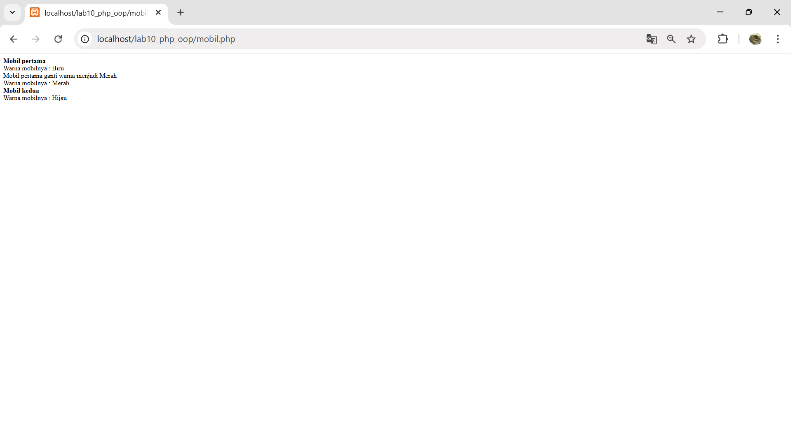
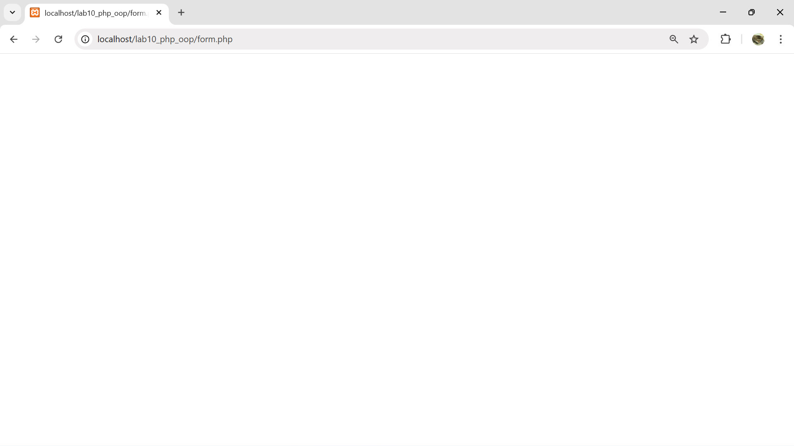
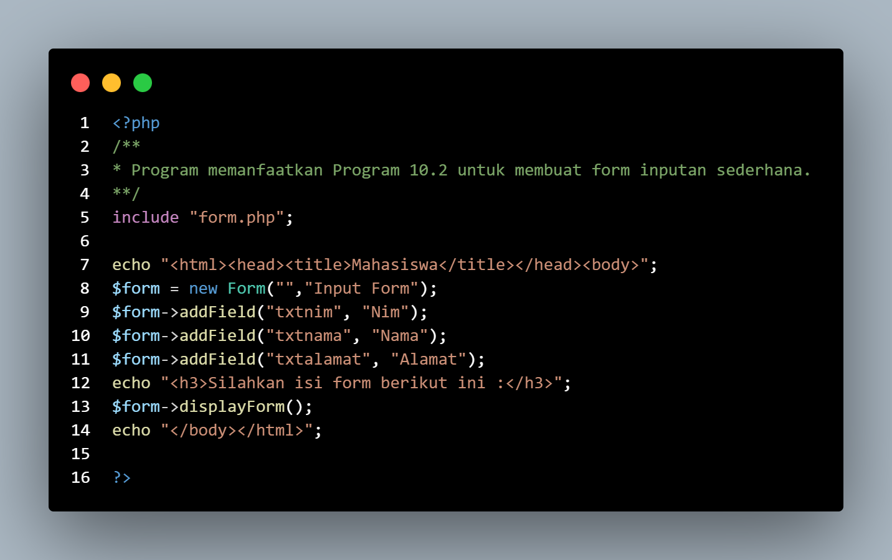
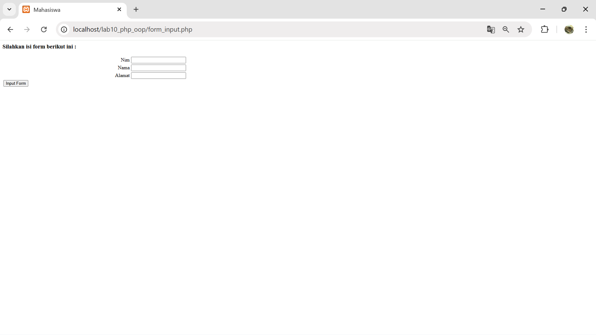
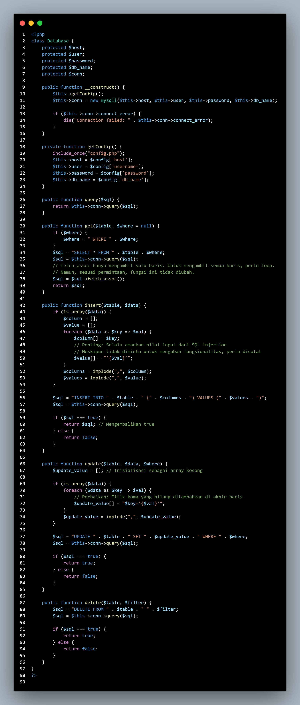
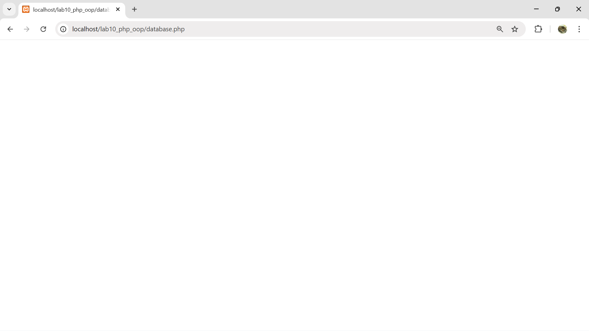

# Pratikum 10: PHP OOP
### NAMA : Raihan Ardiansyah
### NIM : 312410396
### KELAS : TI.24.A3

**Langkah-langkah Praktikum**

- Buat file baru dengan nama mobil.php

- Class Library

Class library merupakan pustaka kode program yang dapat digunakan bersama pada beberapa
file yang berbeda (konsep modularisasi). Class library menyimpan fungsi-fungsi atau class
object komponen untuk memudahkan dalam proses development aplikasi.

- Contoh class library untuk membuat form.

- Buat file baru dengan nama form.php

File tersebut tidak dapat dieksekusi langsung, karena hanya berisi deklarasi class. Untuk
menggunakannya perlu dilakukan include pada file lain yang akan menjalankan dan harus
dibuat instance object terlebih dulu.

- Contoh implementasi pemanggilan class library form.php

- Buat file baru dengan nama form_input.php

- Contoh lainnya untuk database connection dan query. Buat file dengan nama database.php

**Pertanyaan dan soal**
